## UniAPM智能运维平台

UniAPM运维管理软件监控指标体系是一套面向业务服务、层次化、可量化的监控指标体系。该体系是以ITIL为理论基础，实现IT管理与业务服务的融合。从业务的视角来重新定位企业的IT系统，以可视化方式为管理者提供一览式的IT服务状况，确保IT服务可管理、可测量。

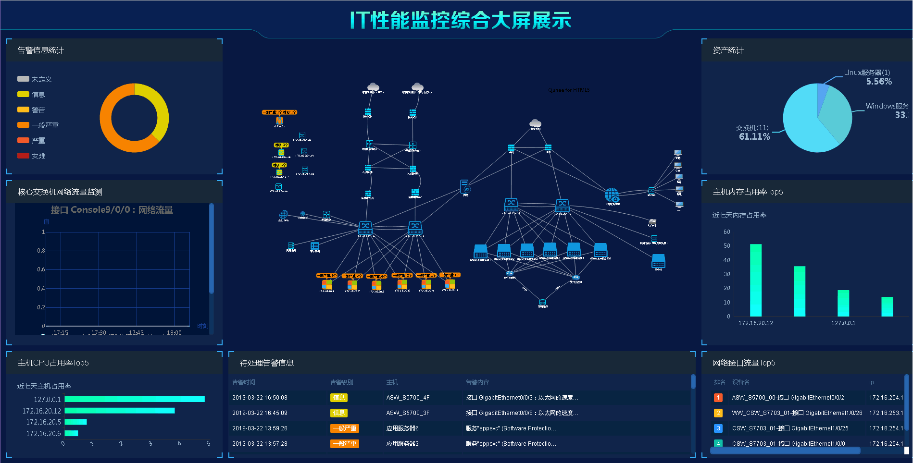

项目地址：[Github](https://github.com/silianpan/uniapm-web)、[国内Gitee](https://gitee.com/twofloor/uniapm-web)

演示地址：http://silianpan.cn/apm/

演示账号：admin 密码：admin

**欢迎沟通交流，作者(wx:twofloor1993,qq:2480621579)**

### 部分截图

* 首页

  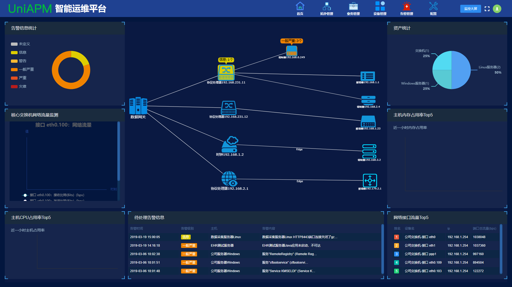

* 资源总览

  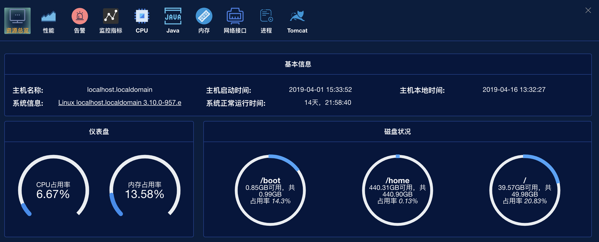

* 性能

  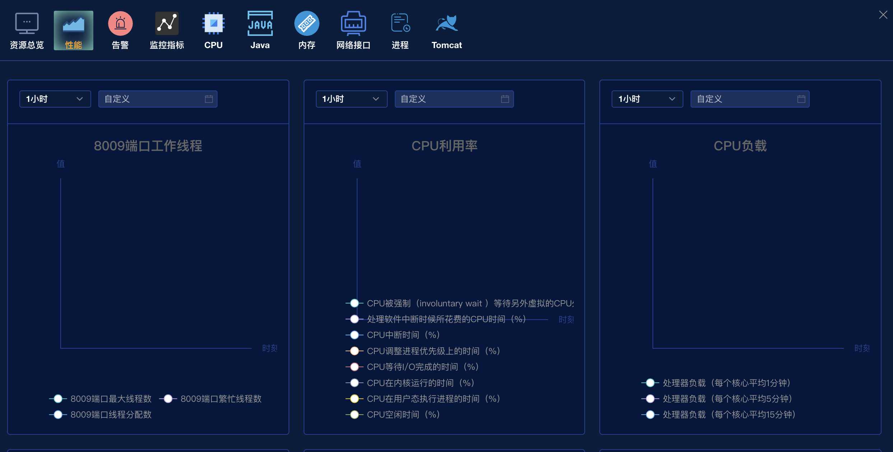

* 告警

  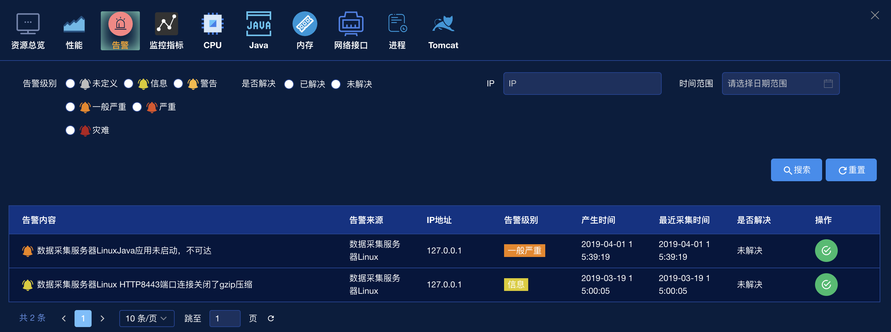

* 监控指标

  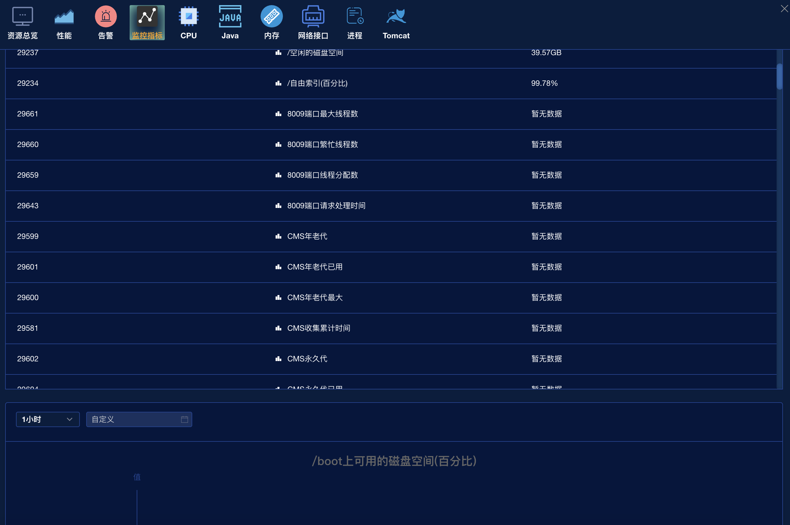

* CPU监控

  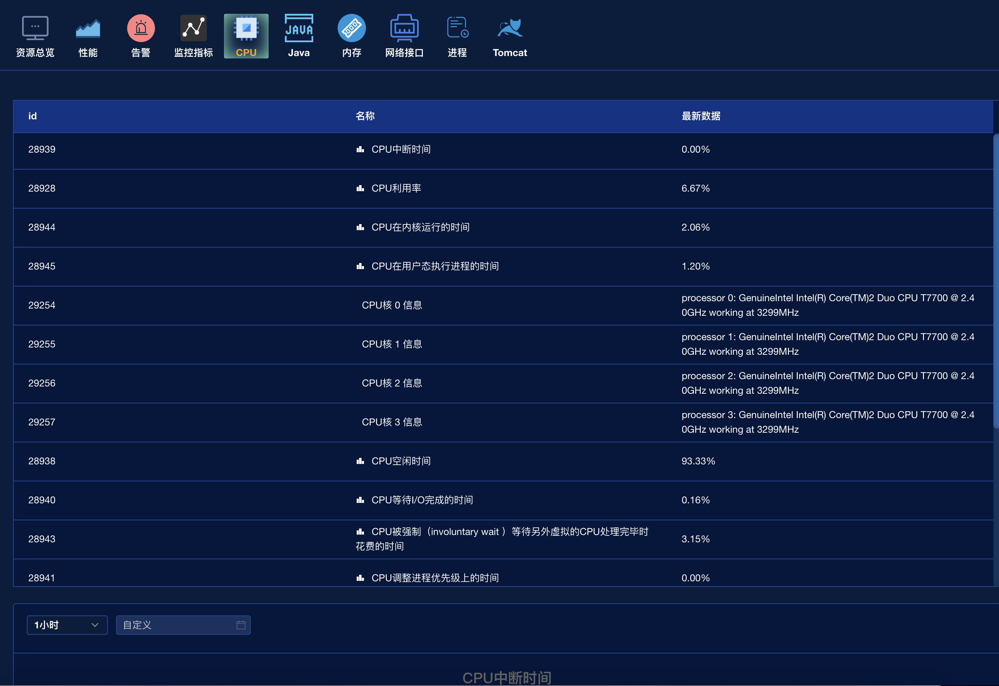

* 内存监控

  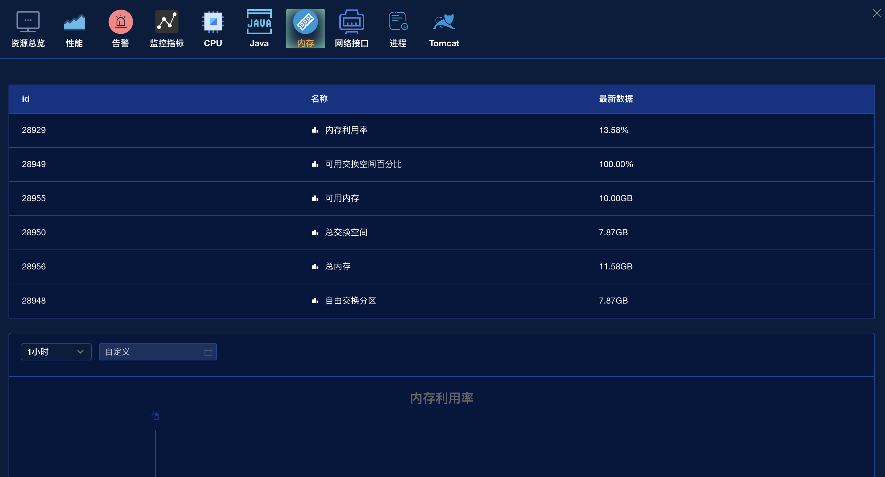

* 流量监控

  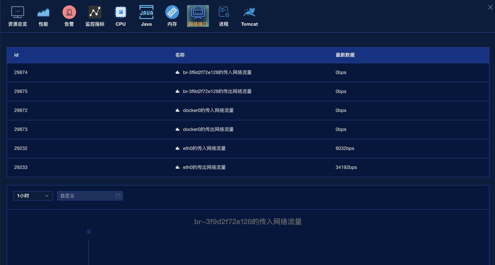

* 进程监控

  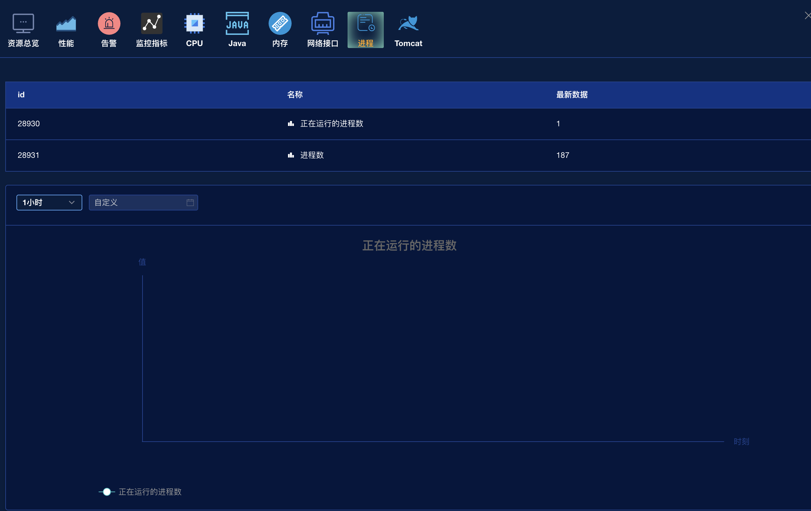

* Java应用监控

  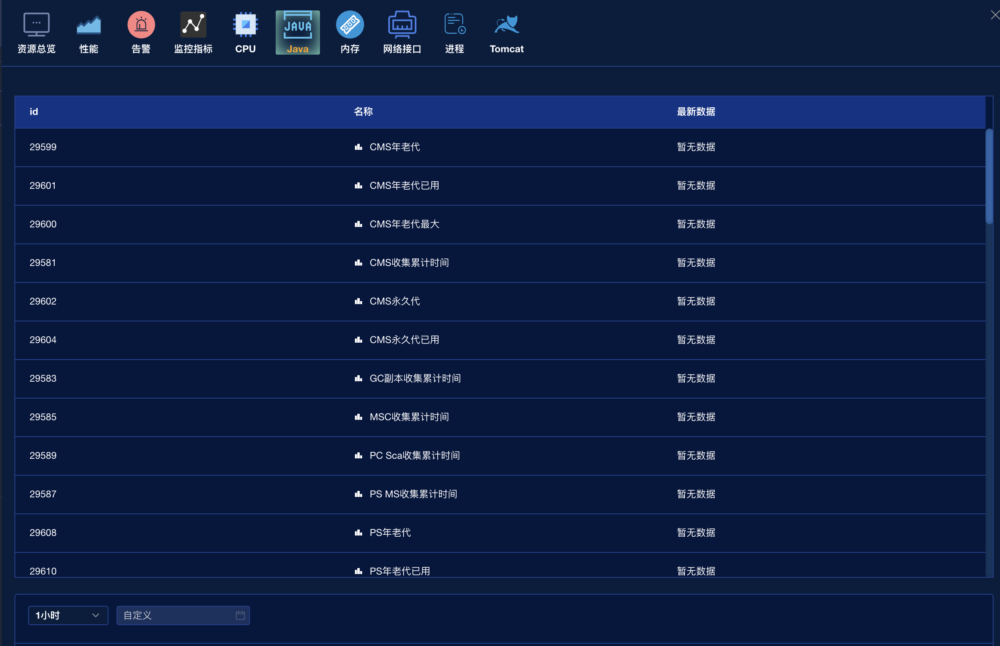

* Tomcat应用监控

  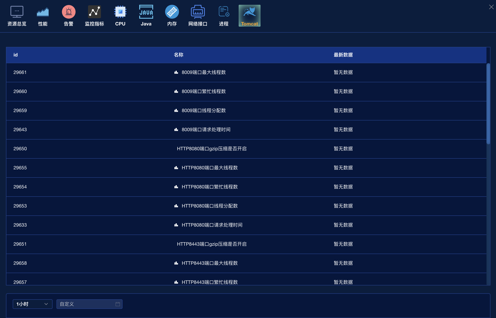

