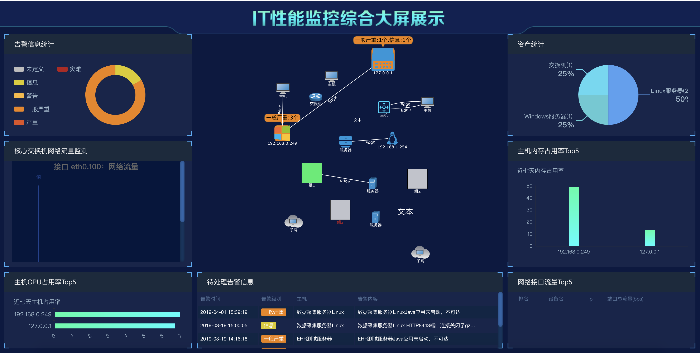
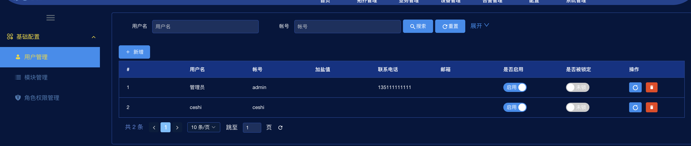
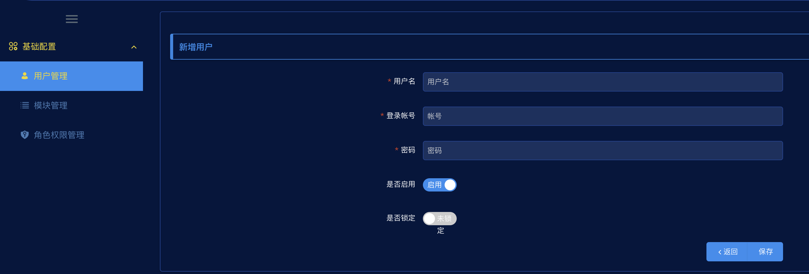

## UniAPM运维管理软件用户手册

### 目录

[1 概述](#概述)

[2 运行环境](#运行环境)

[3 首页](#首页)

[4 监控大屏](#监控大屏)

[5 综合展示平台](#综合展示平台)

[5.1 智能运维管理](#智能运维管理)

[5.2 CPU监控](#cpu监控)

[5.3 内存监控](#内存监控)

[5.4 流量监控](#流量监控)

[5.5 进程监控](#进程监控)

[5.6 Java应用监控](#java应用监控)

[5.7 Tomcat应用监控](#tomcat应用监控)

[6 拓扑管理](#拓扑管理)

[6.1 新增、编辑、删除拓扑](#新增编辑删除拓扑)

[6.2 拖动新增拓扑](#拖动新增拓扑)

[6.3 操作拓扑](#操作拓扑)

[6.4 属性编辑](#属性编辑)

[6.5 更改图标](#更改图标)

[6.6 关联主机](#关联主机)

[7 业务管理](#业务管理)

[7.1 业务拓扑](#业务拓扑)

[8 告警管理](#告警管理)

[9 配置管理](#配置管理)

[9.1 模板配置](#模板配置)

[9.2 主机配置](#主机配置)

[10 系统管理](#系统管理)

[10.1 用户管理](#用户管理)

[10.2 菜单管理](#菜单管理)

[10.3 权限管理](#权限管理)

### 1 概述

UniAPM运维管理软件监控指标体系是一套面向业务服务、层次化、可量化的监控指标体系。该体系是以ITIL为理论基础，实现IT管理与业务服务的融合。从业务的视角来重新定位企业的IT系统，以可视化方式为管理者提供一览式的IT服务状况，确保IT服务可管理、可测量。

本产品在设计监控模型过程中，通过层次分析法将监控要素划分为相互联系的各个单元，根据上下层次之间的隶属关系以及同一层次内两两元素之间的依赖关系进行定量描述，构建出一个关系矩阵，全面覆盖应用系统、数据库、中间件、服务器、存储和网络各个领域。确保任何一个领域出现风险隐患时，运维人员均可以主动、及时地发现、预警、分析和处置，把风险控制在萌芽状态，保证业务连续性。

在网络及服务器层面，按照管理特性可分为设备的处理器、内存、温度、系统、设备端口、运行协议等不同纬度客观反映硬件环境的运行情况和运行质量。

在系统资源层面可以分为数据库类、中间件、操作系统类和存储四大类。其中数据库类的指标可以分别反映服务器的运行状态、实例的运行状态、会话数、锁资源和监听器的运行状态。中间件类根据不同的使用特性，细分为业务中间件和消息中间件等。操作系统类可以按照使用环境分为Windows、Linux和Unix三种，客观反映各种主流操作系统的运行状态。存储系统类可分为光纤交换机、光纤交换机端口、存储系统、和光纤链路，客观反映存储系统端到端的运行状况。

在业务应用服务层面，能够实时反映交易应用进程的运行状态。其中交易进程类指标包括交易队列的使用情况、资源消耗情况；交易数据类指标包括交易笔数，交易并交易笔数、交易平均响应时间等。

上述领域的监控指标通过代理和非代理监测两种方式进行收集整理、分类汇总和关联分析，进行IT系统统一监控管理，实现了性能管理、告警管理、故障分析等风险处置功能。

### 2 运行环境

硬件环境

数据库服务器：IBM POWER 550

应用服务器：INTEL X64

操作系统：CentOS

### 3 首页

输入网址http://17.0.0.1/apm，进入登录页面：

{width="5.768055555555556in"
height="2.9291666666666667in"}

输入用户名，密码后，进入首页:

{width="5.768055555555556in"
height="2.9027777777777777in"}

在首页中，展示了设备状态、系统状态、告警分析、待处理问题等业务模块。

### 4 监控大屏

点击右上角"监控大屏"按钮，进入监控大屏展示页面。

{width="5.768055555555556in"
height="2.9166666666666665in"}

在监控大屏中，展示了告警信息统计、核心交换机和网络流量监测、主机CPU占用率Top5、待处理告警信息、磁盘监控、主机内存点用率Top5、网络接口流量Top5、拓扑图监控模块。

### 5 综合展示平台

综合展示平台包括智能运维管理（监控设备管理）、设备健康度、CPU监控、内存监控、流量监控等。

#### 5.1 智能运维管理

智能运维管理主要是对不同类型的设备进行管理，主要包括设备分组、添加设备、编辑设备、删除设备、查看设备性能、查看设备面板图等。

##### 5.1.1 添加设备

点击顶部"配置"菜单，进去页面继续点击"配置"菜单，再点击"主机"菜单，点击右上角创建主机"按钮，进入添加主机页面：

{width="5.768055555555556in"
height="2.2569444444444446in"}

进入设备信息填写界面。

{width="5.768055555555556in"
height="2.64375in"}

填写主机名称、IP地址或DNS名称、更改端口等信息，之后点击创建按钮，完成设备添加。

##### 5.1.2 分组管理

点击顶部"设备管理"菜单栏，左侧出现设备分组，点击每个分组，可以查看改组下面的所有设备。

{width="5.768055555555556in"
height="1.9743055555555555in"}

##### 5.1.3 查看性能

点击每个设备名称，可以查看每个主机的基本信息和其他性能等信息。

{width="5.768055555555556in"
height="2.1034722222222224in"}

{width="5.768055555555556in"
height="2.33125in"}

{width="5.768055555555556in"
height="2.9208333333333334in"}

{width="5.768055555555556in"
height="2.1555555555555554in"}

{width="5.768055555555556in"
height="3.8375in"}

##### 5.1.4 编辑、删除

点击"操作"栏"编辑"按钮可以编辑设备信息、点击"删除"按钮即可删除该设备。

{width="5.768055555555556in"
height="2.2006944444444443in"}

{width="5.768055555555556in"
height="4.211805555555555in"}

#### 5.2 CPU监控

{width="5.768055555555556in"
height="3.959722222222222in"}

#### 5.3 内存监控

{width="5.768055555555556in"
height="3.111111111111111in"}

#### 5.4 流量监控

{width="5.768055555555556in"
height="3.0944444444444446in"}

#### 5.5 进程监控

{width="5.768055555555556in"
height="3.6375in"}

#### 5.6 Java应用监控

{width="5.768055555555556in"
height="3.727777777777778in"}

#### 5.7 Tomcat应用监控

{width="5.768055555555556in"
height="3.7006944444444443in"}

### 6 拓扑管理

拓扑管理是以拓扑图形式对目前的网络进行监控。直观展示网络及终端设备运行情况。

#### 6.1 新增、编辑、删除拓扑

点击顶部"拓扑管理"菜单，进入子菜单页面。

{width="5.768055555555556in"
height="1.8979166666666667in"}

点击"操作"栏可以编辑、删除、查看拓扑图。

{width="5.768055555555556in"
height="2.654861111111111in"}

#### 6.2 拖动新增拓扑

拖动左边小图标可以添加设备。

#### 6.3 操作拓扑

顶部工具栏可以操作图标拖动、放大、缩小等。

右上角是拓扑图鹰眼图。

#### 6.4 属性编辑

点击添加的设备，可以进行基本属性编辑。

{width="5.768055555555556in"
height="4.141666666666667in"}

#### 6.5 更改图标

点击编辑"更改图标"按钮可以设置图标。

{width="5.768055555555556in"
height="2.923611111111111in"}

#### 6.6 关联主机

点击"关联主机"按钮可以关联监控的设备。

{width="5.768055555555556in"
height="2.90625in"}

### 7 业务管理

业务管理是针对不同业务性质的监控管理，主要针对不用业务，不同应用，不同拓扑图进行监控及管理。

#### 7.1 业务拓扑

点击顶部"业务管理"菜单，会展示拓扑图列表。

{width="5.768055555555556in"
height="1.5284722222222222in"}

点击每个业务右上角"编辑"按钮可以进行编辑。

{width="4.736111111111111in"
height="3.4027777777777777in"}

编辑页面可以进行设备添加、删除、选择想要查看的监控图形。

{width="5.768055555555556in"
height="1.6479166666666667in"}

点击业务"查看"按钮，可进行该业务的查看。

{width="5.555555555555555in"
height="3.2222222222222223in"}

{width="5.768055555555556in"
height="2.5819444444444444in"}

### 8 告警管理

告警管理功能包括告警日志的查询、告警通知的配置、告警的处理。

{width="5.768055555555556in"
height="2.3916666666666666in"}

点击"操作"栏按钮，可以关闭此告警。

{width="5.768055555555556in"
height="1.5888888888888888in"}

### 9 配置管理

#### 9.1 模板配置

模板配置是对监控设备的模板进行配置，包括监控类型、监控指标配置。

{width="5.768055555555556in"
height="1.2881944444444444in"}

#### 9.2 主机配置

主机配置是对配置对主机（网络设备、终端设备）的监控。

{width="5.768055555555556in"
height="2.173611111111111in"}

### 10 系统管理

系统管理主要包括用户管理、菜单管理、权限管理以及大屏配置。

#### 10.1 用户管理

用户管理主要对用户进行新增、编辑、删除，以及分配角色等操作。

{width="5.768055555555556in"
height="1.225in"}

##### 10.1.1 新增用户

点击"新增用户"按钮，弹出框填写用户名，用户姓名，性别，点击保存按钮，完成用户新增。

{width="5.768055555555556in"
height="1.9569444444444444in"}

##### 10.1.2 编辑、删除用户

点击操作栏"编辑""删除"按钮可以对用户进行基本信息编辑和删除用户。

##### 10.1.3 分配角色

点击操作栏"分配角色"按钮，弹出角色选择框选择，同时展示已经选择的角色列表。

{width="5.768055555555556in"
height="1.2027777777777777in"}

{width="5.768055555555556in"
height="2.475in"}

{width="5.768055555555556in"
height="2.09375in"}

#### 10.2 菜单管理

点击"菜单管理"，以树形结构展示层级菜单。选择某个层级的菜单，右键单击，弹出"新增""删除""编辑"三个可选择按钮。

点击"新增"可以新增该菜单下的子菜单，点击"删除"可以删除该菜单，点击"编辑"可以编辑该菜单信息。

{width="5.768055555555556in"
height="2.0347222222222223in"}

##### 10.2.1 新增菜单

{width="5.768055555555556in"
height="3.2118055555555554in"}

##### 10.2.2 修改菜单

{width="5.768055555555556in"
height="2.932638888888889in"}

##### 10.2.3 删除菜单

{width="4.055555555555555in"
height="2.2916666666666665in"}

#### 10.3 权限管理

权限管理是对角色权限的管理。

点击权限管理菜单，可以对角色进行新增、编辑、删除，分配功能菜单权限等。

{width="5.768055555555556in"
height="2.392361111111111in"}

##### 10.3.1 新增角色

点击"新增角色"按钮，填写角色名、选择角色有效性，点击确定即可完成角色的新增。

{width="5.768055555555556in"
height="2.0743055555555556in"}

##### 10.3.2 编辑删除角色

点击操作栏"编辑""删除"按钮可以对角色进行信息编辑及删除操作。

##### 10.3.3 分配菜单功能权限

点击操作栏"菜单功能权限"按钮，可以对该角色的菜单功能权限进行分配和取消。

{width="5.768055555555556in"
height="2.392361111111111in"}

弹出菜单树结构，点击checkbox进行分配和取消分配。

{width="5.768055555555556in"
height="2.5694444444444446in"}
